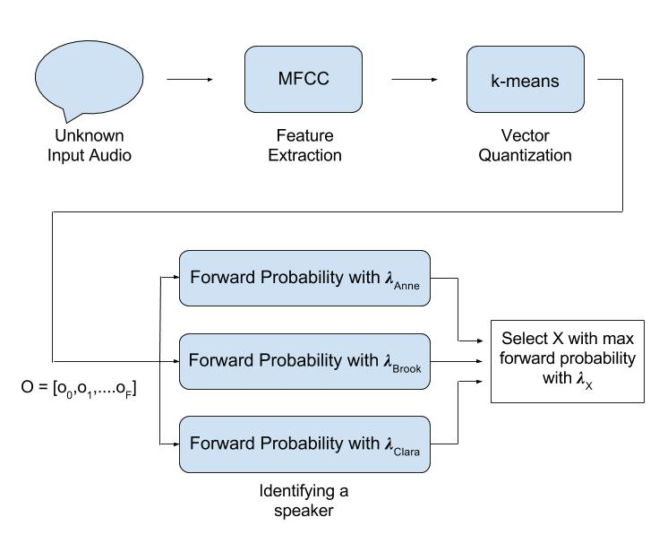

For this project, we explored audio localization and speaker recognition with the goal of building a robot that identifies unique speaker locations and voices.  For the purpose of audio localization, we learned how to calculate the angle of a speaker in relation to the robot, using the geometry of our two microphones and the time differences between the sound received by each of them.  For the purpose of speaker recognition, we studied Mel-frequency cepstral coefficients, vector quantization with K-means, and hidden Markov models to extract and analyze features of each person’s voice.

### System Architecture

Our speaker recognition system is organized into three ROS nodes.  Audio Localization is the first node, which calculates the position of the current speaker in three-dimension space and controls the robot so that it faces the speaker.  The MFCC + HMM node is for training and recognizing speakers, which it does using Mel-frequency cepstral coefficients (MFCC) and a hidden Markov model (HMM).  We had also planned to implement a node responsible for both streaming the audio that is received by two microphones on a Raspberry Pi and for interacting with the user, who can choose to either train a new speaker or to attempt to recognize voices.  As of now, we do not have a fully integrated system, and the first two nodes are run separately. 

### Data Collection

We collected audio data for both testing our audio localizer and training our speech recognizer.  To do so, we taped the microphones attached to the Raspberry Pi onto a flat table a foot apart from each other, to simulate how they would be spaced on a Neato robot. We used measured string as a guide to position our speakers two feet away from the center of the microphones.

To collect data for audio localization, we recorded one of us speaking for 2 seconds each at 0, 45, 90, -45, and -90 degrees, approximately 2 feet away from the center of the microphones.  We used this data to test whether we could accurately predict the angle of the speaker from the microphones.  This angle can be used to turn the robot to face the current speaker during a conversation.

For speaker recognition data, we recorded the 5 people reading out a series of phonetic pangrams, phrases that try to encompass all of the sounds found in the English language, and a longer passage about elephants.  This data was used to both train hidden Markov models for each speaker and to test the accuracy of our recognition system.

### Audio Localization

We are using two microphones connected to a Raspberry Pi to record voices for audio localization. By using two microphones, we calculate the Interaural Time Difference (ITD)  of a person’s speech. This time difference between a sound being picked up by each microphone can be used to find the direction of the sound in space.

This diagram came from [this](https://pdfs.semanticscholar.org/c852/7c54b90e508cbf2c6ecb668e5ec94a15a30e.pdf) paper on audio localization.

We were able to successfully predict the angle of a speaker by finding the most frequently occurring angle calculation over the duration of the audio clip.  The following graphs illustrate our angle calculations for a speaker approximately -90, -45, 0, 45, and 90 degrees from the microphones, respectively.  Although the results are somewhat noisy, finding the mode angle works reliably to predict the speaker’s approximate orientation.  This mode angle is extracted, which the audio localizer uses to turn toward using proportional control.

### Demo Videos

Robot turning 90 degrees: https://drive.google.com/open?id=0B6n1zsVOIMe6ZWFHVmttb09rNms

Robot turning 180 degrees: https://drive.google.com/open?id=0B6n1zsVOIMe6MEdtRHU0S2JGTmc 

### Results

### MFCCs

MFCCs are used widely in speaker recognition problems, and their purpose in this context is to extract features from audio that are well-suited for uniquely identifying a human voice.  We will use the python_speech_features library to extract voice features from both our training dataset and our live conference calls.  This involves splitting the audio in frames of 20 ms, calculating the power spectrum of each frame, and applying a mel filterbank to the power spectra to calculate the energy in each filter.  The result is a set of MFCC coefficients for each frame.  We then compress this data so that we are left with only the key information needed for speaker identification.  To do so, we use vector quantization to cluster these frames around a smaller number of centroid points, using with the K-means algorithm.  These centroid points are given labels and compiled into a codebook that represents the speaker in question.  These centroid points, or voice features, represent an observation sequence that is used to calculate the parameters for a hidden Markov model for the speaker.

### Hidden Markov Model

Given this set of features extracted from a particular speaker’s voice, we train a hidden Markov model (HMM) to represent the speaker so that he or she can be identified.  
A hidden Markov models can  be used to emulate a system with a finite number of hidden states that generate a set of events, or observations, and where the current state is dependent only on the previous state.  An HMM is composed of a set of states Q, a transition probability matrix A, a sequence of observations O, and a sequence of emission probabilities B.  In the case of speaker recognition, O represents the set of features of a speaker’s voice, A represents the set of probabilities of moving between each pair of hidden states, and B represents the set of probabilities of generating each voice feature (observation) from each hidden state.
Training a model involves initializing the A and B probability matrices and then iteratively updating their values for a particular speaker.  This requires a set of observations as input, in the form of MFCC features, extracted from a voice sample.  A and B are referred to as lambda, and make up the model that voices are tested against during speaker recognition.
The forward and backward algorithms are used to update the A (transition) and B (emission) matrices.  The Baum-Welch algorithm uses the forward and backward algorithms to iteratively update these matrices until they converge, at which point the speaker’s model is saved.

The following diagram illustrates the process of training an HMM

Recognizing a speaker involves determining which existing speaker model yields the highest probability of corresponding to the live speaker audio.  This involves once again extracting MFCC features from the audio, using vector quantization to compress them, and running these observations through the forward algorithm for each existing speaker model to calculate a relative probability that it belongs to the current speaker.  Once a probability is calculated for each speaker, the speaker model that corresponds to the highest probability is returned as the recognized speaker.  The following diagram illustrates the process of recognizing a speaker, given a set of three trained models.

We implemented the hidden Markov model algorithms from scratch, so we needed a way to validate that they were working correctly.  To do so, we tested our system with what is known as the ice cream problem.  One of the advantages of the ice cream problem is that both its observations and its hidden states are clearly defined.  The concept is that you would like to predict weather patterns (sequence of hidden states) using your ice-cream consumption (observations).  You keep a diary of how many ice creams you eat everyday, and you make the assumption that there is some correlation between the weather that day (hot or cold) and your ice cream consumption.  You also make the assumption that the weather on a particular day is dependent only on the weather of the day before.  The transition probabilities represent the chances of going from, for example, a hot day to a cold day.  The emission probabilities represent the chance of, for example, you eating 3 ice creams on a hot day.  We referenced [this implementation](http://cs.jhu.edu/~jason/papers/eisner.hmm.xls) of a hidden Markov Model using the ice cream problem, discussed in [Jason Eisner’s](https://cs.jhu.edu/~jason/papers/eisner.tnlp02.pdf) paper, to verify that our hidden Markov model produced the same results.

Although our ice cream problem validation was successful, when we tested our model on voice features generated from our MFCC calculation, we were not able to reliably recognize the speaker associated with the tested voice sample.  In particular, one of our speakers, Shruti, was consistently rated as the highest probability model for each of our tests, regardless of the person speaking.

### Challenges

In order to solve the problem of incorrect prediction, we tried a few different things. The first one was to create a common codebook with all the voices. After implementing it, we found that each person’s observation was different. But, after each iteration of training, the transition and emission probabilities didn’t change or update at all. We are still not sure what would cause that problem nor were we able to detect a bug in our code itself. We realize that having a common codebook is really important and if we could change one thing about the existing code, it would be replacing the existing codebook with a common one.

We also thought of increasing the number of observations we give into the training function. But we found out that, past a certain point, we decay to the point that the floating point became equal to 0. This is because of alpha and beta values in forward and backward algorithms. Because of the zero value, we encountered division errors. So, we had to give up this direction. One solution is to use a log scale or numerical stability for the values. 

We also tried increasing the number of training iterations. The more we trained, the higher the forward probabilities of different models were. But that didn’t result in accurate predictions either. 

### Future Work

In the future, we will actually implement a shell script user interface to switch between training a model and testing against a model in the terminal. We will also implement streaming live audio from the Raspberry Pi to recognize people talking in real time. We will probably end up copying short segments of audio over into files on a laptop to preserve the quality of the signal data. We want to fully integrate the different elements of our project into one central script by including audio localization with the HMM functions instead of running them separately.

We originally implemented the MFCC calculation such that a codebook of voice features was generated for each model that we trained.  What makes more sense is to implement a common code book that represents voice features from all of our trained speakers.  This allows for features from each of our speakers to have unique labels.  Otherwise, in the case of individual codebooks, these labels overlap, which does not allow us to distinguish between the first feature of one speaker and the first feature of the next.

We would also add a user interface that lets them to control the training of each individual in the room as well as start recognizing and localizing. We have individual parts (audio localization and hidden markov models and recognizer) but we want to combine all the parts into one big program.
